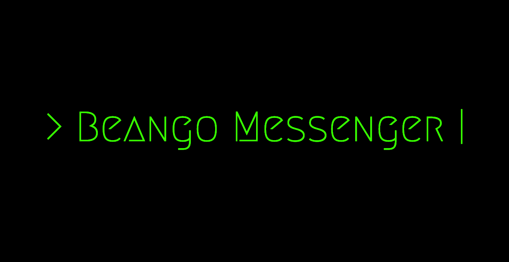

# Beango Messenger

Beango is a messaging app built using Golang and HTMX.

## Approach

### Minimal dependencies

This project uses the bare minimum dependencies, so a lot of things are custom-built from scratch. This does add quite a lot of effort to development, but should provide the benefit of making things more transparent, flexible, and lightweight.

### Adhere to HTMX principles

HTMX was chosen to build to web front end for this app in order to try a different approach to web development. We want state to be managed in a single place, the server. Therefore, we use as little javascript code as possible, and leverage HTMX's features to keep most front end logic in the DOM itself.

## How to run

### With Docker (recommended)

Prequisite: Docker must be installed on your machine

1. Clone `config/default.docker.env` and rename the copy to `docker.env`.
2. Set BG_DB_PASSWORD to a value of your choice. This will be the password used for postgres users.
3. Run `docker-compose up`.

### Without Docker

Prerequisites: Golang, Postgres

1. Create and run your postgres database, set up roles and priviledges as necessary.
2. Clone `config/default.docker.env` and rename the copy to `dev.env`.
3. Change the `BG_DB_USERNAME` and `BG_DB_PASSWORD` envars to match your postgres user. You can also just remove these if you want to use the default postgres user with no password.
4. Run `set -a; source config/dev.env; set +a;` to make the envars available to the current shell.
5. Run `go run main.go`